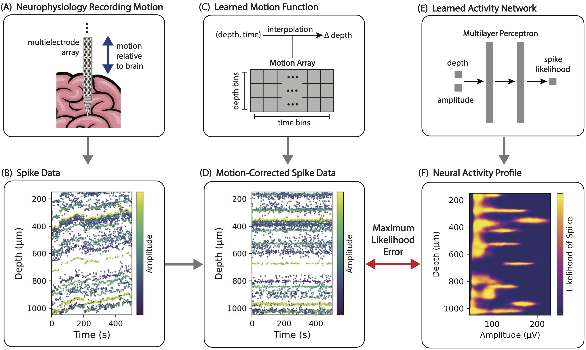

# MEDICINE: Motion Estimation by DIstributional Contrastive Inference for NEurophysioloy

## Introduction

MEDICINE is a method for estimating motion in neurophysiology data for spike
sorting. See our [publication](https://) for a complete description of the
method and results. The general idea of MEDICINE is to decompose neural activity
data into two components:
* The **motion** of the brain relative to a probe in depth.
* An **activity distribution** of the brain along the probe.

These two components are jointly optimized via gradient descent to maximize the
likelihood of a dataset of detected spikes extracted from a neural recording
session. Here is a video of this optimization process in action:


The red curves on the left show the motion learned by the model, the heatmap on
the right show the activity distribution learned by the model and the
scatterplots show detected spikes (colored by amplitude).



## Usage

### Getting Started

We recomend using a virtual environment (e.g. conda or pipenv) to manage
dependencies. Once in a virtual environment, install MEDICINE with:
```
pip install medicine-neuro
```
This will also install the necessary dependencies.

Then you can run the demo script with
```
python -m medicine_demos.run_demo
```
This will run the [`demo
script`](https://github.com/jazlab/medicine/blob/main/medicine_demos/run_demo.py)
and display several figures showing the results. See
[medicine_demos/run_demo.py](https://github.com/jazlab/medicine/blob/main/medicine_demos/run_demo.py)
for more details.

### SpikeInterface Integration

To-Do.

### Kilosort Integration

To-Do.

### Hyperparameters

Here are descriptions of all of the hyperparameters in the [MEDICINE
method](https://github.com/jazlab/medicine/blob/main/medicine/run.py#L20):
* `motion_bound`: Float, default 800. A bound on the maximum allowed absolute
  motion, namely the spread of the motion function output. Units are the same as
  units of spike depth (typically microns). The motion function is smoothed
  after application of this bound, so we recommend being liberal with the bound.
  In all of our recording sessions, the value 800 worked well. Adjusting this
  parameter is unlikely to improve results unless you have very large-magnitude
  motion.
* `time_bin_size`: Float, default 1. Temporal resolution of motion estimation,
  in the same units as the spike times (typically seconds). The motion array
  will discretize the total session duration into temporal bins of this size.
  Note that the actual motion is smoothed and interpolated, so while this
  temporal resolution limits the computational complexity of the motion
  function, it does not make the motion function itself a discrete or step-wise
  function. We find that 1 second is sufficient for all of our datasets.
  Increasing this improves runtime slightly. Adjusting this parameter is
  unlikely to improve results.
* `time_kernel_width`: Float, default 30. Width of the triangular smoothing
  kernel applied to the motion function, in the same units as the spike times
  (typically seconds). If you have very high-frequency motion, you may want to
  reduct this. If you observe over-fitting or have very low firing rates, you
  may want to increase this.
* `activity_network_hidden_features`: Tuple, default (256, 256). Hidden layer
  sizes for the activity network. Adjusting this is unlikely to improve results.
* `num_depth_bins`: Int, default 2. Number of depth bins for motion estimation.
  A value of 1 will enforce uniform/rigid motion at all depths. Higher numbers
  allow more complex dependencies of motion on depth. We find that a value of 2
  to be sufficient for all of our datasets. A value of 2 allows linear
  interpolation of motion between two independently fit motion functions at the
  extremes of the array.
* `amplitude_threshold_quantile`: FLoat in [-1, 1]. Cutoff quantile for peak
  amplitudes. If 0, no cutoff is applied and all peaks are used. If > 0, then
  the smallest amplitude_threshold_quantile fraction of amplitudes are ignored.
  If < 0, then the largest amplitude_threshold_quantile fraction of amplitudes
  are ignored. See "raw_raster_and_amplitudes.png" output figure for a histogram
  of all amplitudes used by the model. Typically 0 is a good value. However, if
  you find that there are a lot of low amplitude spikes and they may be causing
  the model to go astray, you may want to consider making this non-zero. Making
  it positive will remove low-amplitude spikes if the spike amplitudes are
  positive. Making it negative will remove low-amplitude spikes if the spike
  amplitudes are negative.
* `batch_size`: Int, default 4096. Batch size for optimization. Reducing this
  too low can cause unstable convergence (we have observed this with batch size
  1024 and below). Adjusting this parameter is unlikely to improve results.
* `training_steps`: Int, default 10,000. Number of optimization steps to take.
  Reducing this improves runtime, but be careful to keep it greater than
  `motion_noise_steps`. Adjusting this parameter is unlikely to improve results.
* `initial_motion_noise`: Float, default 0.1. Magnitude of noise to add to the
  motion function output at the start of training. This is annealed to 0 in the
  first `motion_noise_steps` of training steps. Adding this noise avoids getting
  caught in local minima early in training. Adjusting this parameter is unlikely
  to improve results.
* `motion_noise_steps`: Int, default 2,000. Number of steps at the beginning of
  training to anneal the motion noise to 0. Adjusting this parameter is unlikely
  to improve results unless you reduce `training_steps`, in which case this
  should be reduced as well.
* `optimizer`: Torch optimizer, default `torch.optim.Adam`. Adjusting this
  parameter is unlikely to improve results.
* `learning_rate`: Float, default 0.0005. Adjusting this parameter is unlikely
  to improve results.
* `epsilon`: Float, default 0.001. Prevents divide-by-zero instabilities.
  Adjusting this parameter is unlikely to improve results.
* `plot_figures`: Bool, default `True`. Whether to plot and save figures.

The MEDICINE model is not sensitive to most of these hyperparameters. We have
never needed to tune hyperparameters for any of dozens of our NHP
neurophysiology datasets. The only parameters we can imagine may be necessary to
tune are `motion_bound` and `time_kernel_width`.

## Reproducing Our Results

To reproduce the results in our paper, please see
[https://jazlab.github.io/medicine_paper/](https://jazlab.github.io/medicine_paper/).
This has all code and instructions for replicating our results.

## Contact and Support

Please see
[`CONTRIBUTING.md`](https://github.com/jazlab/medicine/blob/main/CONTRIBUTING.md)
for information about support. Please email Nick Watters at nwatters@mit.edu
with questions and feedback.

## Reference

If you use MEDICINE or a derivative of it in your work, please cite it as
follows:

```
@misc{watters2024,
author = {Nick Watters and ...},
title = {MEDICINE: Motion Estimation by DIstributional Contrastive Inference for NEurophysiology},
url = {https://arxiv.org/},
journal = {arXiv preprint arXiv:},
year = {2024}
}
```

## MEDICINE Website

The [MEDICINE website](https://jazlab.github.io/medicine/) is a [GitHub
Pages](https://pages.github.com/) website with a [Slate
theme](https://github.com/pages-themes/slate). The website is generated from
this [`README.md`](https://github.com/jazlab/medicine/blob/main/README.md) with
the settings in
[`_config.yml`](https://github.com/jazlab/medicine/blob/main/_config.yml) and
the Ruby dependencies in
[`Gemfile`](https://github.com/jazlab/medicine/blob/main/Gemfile).

If you would like to modify the website, first make sure you can test deploying
it locally by following the [GitHub Pages testing
instructions](https://docs.github.com/en/pages/setting-up-a-github-pages-site-with-jekyll/testing-your-github-pages-site-locally-with-jekyll).
Then modify this
[`README.md`](https://github.com/jazlab/medicine/blob/main/README.md) and test
deploy to view the changes before committing.
